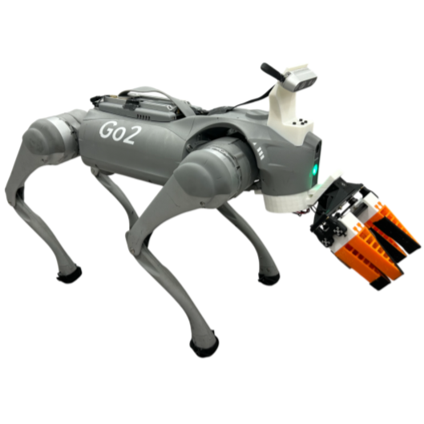

# Helpful DoggyBot: Open-World Object Fetching using Legged Robots and Vision-Language Models
<p align="center">

</p>

**Authors**: [Qi Wu](https://wooqi57.github.io/), [Zipeng Fu](https://zipengfu.github.io/), [Xuxin Cheng](https://chengxuxin.github.io/), [Xiaolong Wang](https://xiaolonw.github.io/), [Chelsea Finn](https://ai.stanford.edu/~cbfinn/)   
**Website**: https://helpful-doggybot.github.io/  
<!-- **Paper**: https://arxiv.org/abs/2309.14341   -->
<!-- **Tweet Summary**: https://twitter.com/pathak2206/status/1706696237703901439 -->


## Whole body controller

### Installation ###
```bash
conda create -n doggybot python=3.8
conda activate doggybot
cd
pip3 install torch 
pip3 install torchvision
git clone git@github.com:WooQi57/Helpful-Doggybot.git
cd Helpful-Doggybot
# Download the Isaac Gym binaries from https://developer.nvidia.com/isaac-gym 
cd isaacgym/python && pip install -e .
cd ~/Helpful-Doggybot/whole_body_controller/rsl_rl && pip install -e .
cd ~/Helpful-Doggybot/whole_body_controller/legged_gym && pip install -e .
pip install "numpy<1.24" pydelatin wandb tqdm opencv-python ipdb pyfqmr flask imageio[ffmpeg]
```

### Usage ###
`cd legged_gym/scripts`
1. Train base policy:  
```bash
python train.py --task go2 --exptid xxx-xx-DESCRIPTION --device cuda:0
```

2. Train distillation policy:
```bash
python train.py --task go2 --exptid yyy-yy-DESCRIPTION --device cuda:0 --resume --resumeid xxx-xx --use_camera
```

3. Play base policy:
```bash
python play.py --exptid xxx-xx
```

4. Play distillation policy:
```bash
python play.py --exptid yyy-yy --use_camera
```

5. Save models for deployment:
```bash
python save_jit_vis.py --exptid xxx-xx
```
This will save the models in `legged_gym/logs/doggybot/xxx-xx/traced/`.

### Viewer Usage
Can be used in both IsaacGym and web viewer.
- `ALT + Mouse Left + Drag Mouse`: move view.
- `[ ]`: switch to next/prev robot.
- `Space`: pause/unpause.
- `F`: switch between free camera and following camera.

### Arguments
- --exptid: string, can be `xxx-xx-DESCRIPTION`, `xxx-xx` is typically numbers only. `DESCRIPTION` is the description of the run. 
- --device: can be `cuda:0`, `cpu`, etc.
- --checkpoint: the specific checkpoint you want to load. If not specified load the latest one.
- --resume: resume from another checkpoint, used together with `--resumeid`.
- --seed: random seed.
- --no_wandb: no wandb logging.
- --use_camera: use camera or scandots.
- --web: used for playing on headless machines. It will forward a port with vscode and you can visualize seemlessly in vscode with your idle gpu or cpu. [Live Preview](https://marketplace.visualstudio.com/items?itemName=ms-vscode.live-server) vscode extension required, otherwise you can view it in any browser.

## Overhead Vlm
### Installation ###
```bash
conda create -n overhead_vlm python=3.10
conda activate overhead_vlm
```

Please follow the instructions [here](https://github.com/facebookresearch/segment-anything-2) to install sam2 and download the checkpoints under the path `Helpful-Doggybot/segment-anything-2/checkpoints/`.   
Then install florence2 using:

```bash
pip install autodistill_florence_2
```

### Usage ###
1. Copy your camera calibration results to `overhead/calib_result.npz`.   
The calibration result should be a numpy file with keys `DIM`, `K`, `D`.   

2. Change the ip address `DOG_IP` in florensam_control.py to your robot's ip address.

3. Run the overhead controller:
```bash
python florensam_control.py
```


### Acknowledgement
https://github.com/chengxuxin/extreme-parkour    
https://github.com/autodistill/autodistill-florence-2   

### Citation
```
@inproceedings{wu2024helpful,
        author    = {Wu, Qi and Fu, Zipeng and Cheng, Xuxin and Wang, Xiaolong and Finn, Chelsea},
        title     = {Helpful DoggyBot: Open-World Object Fetching using Legged Robots and Vision-Language Models},
        booktitle = {arXiv},
        year      = {2024},
}
```